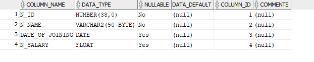

# ` `**History of Organization :**

A **N&N**  hospital is currently working  and the data of hospital   is  stored on registers and flat files systems. The current manual system has a lot of paper work. To maintain the records of sale and service manually, is a Time-consuming task. With the increase in database, it will become a massive task to maintain the database. Requires large quantities of file cabinets, which are huge and require quite a bit of space in the office, which can be used for storing records of previous details. The retrieval of records of previously registered patients will be a tedious task. Lack of security for the records, anyone disarrange the records of your system. If someone want to check the details of the available doctors the previous system does not provide any necessary detail of this type. All this work is done manually by the receptionist and other operational staff and lot of papers are needed to be handled and taken care of. Doctors have to remember various medicines available for diagnosis and sometimes miss better alternatives as they can’t remember them at that time. 

# **Problem and Constraints:**

- Needs lots of paper.
- Problem with maintenance.
- Volumes of data becomes problem. 
- Once data is burned it cannot be reproduced easily.
- Data handling is problem.
# **Objective :**

The Hospital Management System is designed for any hospital to replace their existing manual paper-based system. The new system is to control the information of patients as well as doctors. These services are to be provided in an efficient, cost effective manner, with the goal of reducing the time and resources currently required for such tasks. The complete set of rules & procedures related to Hospital’s day to day activities and generating report is called “Hospital Management System”. It is a computerized management system. This system also keeps the records of hardware assets besides software of this organization. The proposed system will keep a track of Doctors, Patients & appointments. 

## **Goals of objective :**

1. The system should be easy to operate.
1. The working in the organization will be well planned and organized. 
1. The level of accuracy in the proposed system will be higher.
1. The reliability of the proposed system will be high due to proper storage of information.
1. Provide quick and efficient retrieval of information.
# **Scope and Boundaries:**

This database schema is only used to keep the track of appointments and prescription on each appointments. It is unable to deal with other problems like financing and track of all bills . 
# **Story Board of Organization :**

**A N&N** hospital is currently constructed and wants its system to be automated. Hospital deal with different **DERTMENT** and admit **PATIENTS**  . There are many **doctors** in each department ,a department head which is doctor, name ,identification and  location . A doctor has  , name, salary,  **SPETIALIZATION** in maximum one field   **(**if he / she did **)** and   given a unique identification , belong to a department ,joining data an, certification date  and expiry date of  specialization  . When patient come to the hospital  he / she registered  with an identification ,name, father name/ guardian name and given a **appointment** of specific  doctor and have specific appointment identification and appointment time, appointment has **prescription**  and prescription has identification   . Prescription contain  **MEDICINES** for patients and  medicine must have company/brand name and  description .  **TREATMENTS** are done by the  doctor ,for each  treatment  particular cost and treatment only done by the specialized doctor  have identification and name. A specialized doctor can give  treatment to more than one patients .Patient is stayed  in a room in specific block, there are many **BLOCKS**  in hospital  each block assigned an identification and name ,a single block has many rooms , a **ROOM** can only occupied by a single patient a, many rooms in each block and there is single patient in each room .Each room has particular type and identification  Each **NURSE**  has duty in a particular block and assist  the specialized in different treatments and have identification ,name ,salary and date of joining.
#

# **Noun Verb analysis:**

|**Noun**|**Adjective**|**Verb**|
| :- | :- | :- |
|**DEPARTMENT**|Id,location,name||
|**PATIENT**|id ,name ,father name|**Undergoes, stays in** |
|**DOCTOR**|id ,name ,date of joining |**Belongs to, head of**|
|**SPECIALIZATION**|Certification date|**has**|
|**TREATMENT**|Id,cost,name|**done**|
|**ROOM**|ID, type||
|**MEDICINE**|Id, company name ,description ||
|**NURSE**  |ID, name ,date of joining |**Duty in , assist**|
|**APPOINTMENT**|Appoint\_id,appoint\_time|**has**|
|**BLOCK**|Id,name |**has**|
|**PERISCRIPTION**|Prescription id|**contain**|

# **DBMS Selection:**
Oracle SQL developer .

# **Initial ERD:**

# **Normalized ERD:**
")
# **Table Creation:**
## **APPOINTMENT:**
CREATE TABLE APPOINTMENT(

`    `appoint\_id INT,

`    `appointment\_time TIMESTAMP WITH LOCAL TIME ZONE,

`    `doc\_id INT,

`    `p\_id INT,

`    `PRIMARY KEY (appoint\_id),

`    `FOREIGN KEY (doc\_id) REFERENCES DOCTOR (doc\_id),

`    `FOREIGN KEY (p\_id) REFERENCES PATIENT (p\_id)

`    `);

##
## `                                                                                                                                                                                               `**DOCTOR:**
CREATE TABLE DOCTOR(

`    `doc\_id INT not null,

`    `doc\_name VARCHAR2(50) not null,

`    `date\_of\_joining  date,

`   `doc\_salary float(10),

`    `Primary key (doc\_id),

`    `d\_id INT,

`    `FOREIGN KEY (d\_id) REFERENCES DEPARTMENT (d\_id)

`    `);

## **PATIENT:**
CREATE TABLE PATIENT(

`    `p\_id INT not null,

`    `p\_name VARCHAR2(50) not null,

`    `r\_id INT,

`    `Primary key (p\_id),

t\_id INT,

FOREIGN KEY (t\_id) REFERENCES TREATMENT (t\_id),

`    `FOREIGN KEY (r\_id) REFERENCES ROOM (r\_id)

`    `);

## **PRESCRIPTION:**
CREATE TABLE PRESCRIPTION(

`    `prec\_id INT NOT NULL,

`    `Primary key (prec\_id),

`    `appoint\_id INT,

`    `FOREIGN KEY (appoint\_id) REFERENCES APPOINTMENT (appoint\_id));

## **PRESCRIBEDMEDICINE:**

CREATE TABLE PRESCRIBEDMEDICINE(

`    `med\_id INT,

`    `prec\_id INT,

`    `FOREIGN KEY (med\_id) REFERENCES MEDICINE (med\_id),

`    `FOREIGN KEY (prec\_id) REFERENCES PRESCRIPTION (prec\_id)

`    `);

##
## **                                                                                                                                                                                                   
## **MEDICINE:**
CREATE TABLE MEDICINE(

`    `med\_id INT not null,

`    `med\_name VARCHAR2(50) not null,

`    `company\_name VARCHAR2(50) not null,

`    `Primary key (med\_id)

`    `);

## **ROOM:**
CREATE TABLE ROOM(

`    `r\_id INT,

`    `r\_type VARCHAR2(50) not null,

`    `Primary key (r\_id),

`    `b\_id INT,

`    `FOREIGN KEY (b\_id) REFERENCES HOS\_BLOCK (b\_id)

`    `);

## **DEPARTMENT:**
CREATE TABLE DEPARTMENT(

`    `d\_id INT not null,

`    `d\_name VARCHAR2(50) not null,

`    `d\_location VARCHAR2(100),

`   `doc\_id  INT,

FOREIGN KEY (doc\_id)  REFERENCES doctor (doc\_id),

`    `Primary key (d\_id)

`    `);

## **HOS\_BLOCK:**
CREATE TABLE HOS\_BLOCK(

`    `b\_id INT,

`    `b\_name VARCHAR2(50) not null,

`    `Primary key (b\_id)

`    `);

## **TREATMENT:**
CREATE TABLE TREATMENT(

`    `t\_id INT,

`    `t\_name VARCHAR2(50) not null,

`    `t\_cost INT,

`    `Primary key (t\_id)

`    `);

## **SPECIALIZATION:**
CREATE TABLE SPECIALIZATION(

`    `certification\_date date,

`    `doc\_id INT,

`    `FOREIGN KEY (doc\_id) REFERENCES DOCTOR (doc\_id),

`    `t\_id INT,

`    `FOREIGN KEY (t\_id) REFERENCES TREATMENT (t\_id),

`    `Primary key (doc\_id,t\_id)

`    `);

## **NURSE:**
CREATE TABLE NURSE(

`    `n\_id INT,

`    `n\_name VARCHAR2(50) not null,

`    `date\_of\_joining date,

`  `n\_salary float (10),

`    `Primary key (n\_id)

## **NURSEINTREATMENT:**
CREATE TABLE NURSEINTREATMENT(

`    `n\_id INT,

`    `FOREIGN KEY (n\_id) REFERENCES NURSE (n\_id),

`    `t\_id INT,

`    `FOREIGN KEY (t\_id) REFERENCES TREATMENT (t\_id),

`    `Primary key (n\_id,t\_id)

`    `);

## `    `**DUTYINBLOCK:**
CREATE TABLE DUTYINBLOCK(

`    `b\_id INT,

`    `FOREIGN KEY (b\_id) REFERENCES HOS\_BLOCK (b\_id),

`    `n\_id INT,

`    `FOREIGN KEY (n\_id) REFERENCES NURSE (n\_id),

`    `Primary key (n\_id,b\_id)

`    `);

# **Data Entery:**
## **NURSE:**
INSERT INTO NURSE VALUES (1,'Amina', '01-JAN-1999',29990);

INSERT INTO NURSE VALUES (2,'Isha', '09-NOV-2000',76370);

INSERT INTO NURSE VALUES (3,'Ayesha', '10-DEC-2020',56000);

INSERT INTO NURSE VALUES (4,'Zainab', '21-FEB-2001',56540);

INSERT INTO NURSE VALUES (5,'Mamona', '16-MAR-2016',12790);

## **TREATMENT:**
INSERT INTO treatment VALUES (1,'Gene therapy‎', 50000);

INSERT INTO treatment VALUES (2,'Renal dialysis‎', 30000);

INSERT INTO treatment VALUES (3,'Treatment of sleep disorders‎', 15000);

INSERT INTO treatment VALUES (4,'Cancer treatments‎', 240000);

INSERT INTO treatment VALUES (5,'Drugs Treatment', 5000);

## **HOS\_BLOCK:**
INSERT INTO hos\_block VALUES (1,'Quaid-e-Azam Block');

INSERT INTO hos\_block VALUES (2,'Dr. Abdul Qadir Block');

INSERT INTO hos\_block VALUES (3,'Sikandar Block');

INSERT INTO hos\_block VALUES (4,'Himmani Block');

INSERT INTO hos\_block VALUES (5,'New Block');

## **ROOM:**
INSERT INTO room VALUES (1,'Economy', 5);

INSERT INTO room VALUES (2,'AC', 3);

INSERT INTO room VALUES (3,'Economy', 4);

INSERT INTO room VALUES (4,'Professional', 1);

INSERT INTO room VALUES (5,'Economy Plus', 2);

## **PATIENT:**
INSERT INTO patient VALUES (1,'Ajmal','Arshad', 2,1);

INSERT INTO patient VALUES (2,'Saeed','Ajmal', 3,2);

INSERT INTO patient VALUES (3,'Aqsa','Parveeen', 1,3);

INSERT INTO patient VALUES (4,'Maryam','Orangzaib', 5,3);

INSERT INTO patient VALUES (5,'Kameel','Jonson', 4,4);

## **DEPARTMENT :**
INSERT INTO department VALUES (1,'Cardiology', 'Dr. Abdul Qadeer Block');

INSERT INTO department VALUES (2,'General Surgery', 'Himmani Block');

INSERT INTO department VALUES (3,'Neuorology', 'New Block');

INSERT INTO department VALUES (4,'Sexual Health', 'Sikandar Block');

INSERT INTO department VALUES (5,'Orthopedics', 'Quaid-e-Azam Block');

## **DOCTOR:**
INSERT INTO doctor VALUES (1,'Haroon Akram', '06-JAN-2003',5,12000);

INSERT INTO doctor VALUES (2,'Abdullah Rana', '03-DEC-2010',4,60000);

INSERT INTO doctor VALUES (3,'Reshaeel Nisar', '10-DEC-2009',1,43000);

INSERT INTO doctor VALUES (4,'Talha Munir', '10-SEP-2001',3,10000);

INSERT INTO doctor VALUES (5,'Fahad Hassan', '13-AUG-2016',2,10000);

## **SPECIALIZTAION:**
INSERT INTO specialization VALUES ('26-FEB-2004',3,2);

INSERT INTO specialization VALUES ('13-JUL-1998',1,3);

INSERT INTO specialization VALUES ('02-DEC-2014',5,4);

INSERT INTO specialization VALUES ('18-NOV-2019',4,5);

INSERT INTO specialization VALUES ('21-SEP-2018',2,1);

## **NURSEINTREATMENT:**
INSERT INTO nurseintreatment VALUES (2,5);

INSERT INTO nurseintreatment VALUES (1,3);

INSERT INTO nurseintreatment VALUES (3,2);

INSERT INTO nurseintreatment VALUES (5,4);

INSERT INTO nurseintreatment VALUES (4,1);

## **DUTYINBLOCK:**
INSERT INTO dutyinblock VALUES (3,4);

INSERT INTO dutyinblock VALUES (2,1);

INSERT INTO dutyinblock VALUES (1,5);

INSERT INTO dutyinblock VALUES (4,2);

INSERT INTO dutyinblock VALUES (5,3);

## **APPOINTMENT:**
INSERT INTO appointment VALUES (1,CURRENT\_TIMESTAMP,3,4);

INSERT INTO appointment VALUES (2,CURRENT\_TIMESTAMP,4,5);

INSERT INTO appointment VALUES (3,CURRENT\_TIMESTAMP,1,3);

INSERT INTO appointment VALUES (4,CURRENT\_TIMESTAMP,2,1);

INSERT INTO appointment VALUES (5,CURRENT\_TIMESTAMP,5,2);

## **PRESCRIPTION:**
INSERT INTO prescription VALUES (1,3);

INSERT INTO prescription VALUES (2,4);

INSERT INTO prescription VALUES (3,1);

INSERT INTO prescription VALUES (4,5);

INSERT INTO prescription VALUES (5,2);

## **MEDICINE:**
INSERT INTO medicine VALUES (1,'aripiprazole','Abilify');

INSERT INTO medicine VALUES (2,'albumin-bound paclitaxel','Abraxane');

INSERT INTO medicine VALUES (3,'isotretinoin capsule','Absorica');

INSERT INTO medicine VALUES (4,'quinapril HCI','Accupril');

INSERT INTO medicine VALUES (5,'quinapril/HCTZ tablet','Accuretic');

## **PRECRIBEDMEDICINE:**
INSERT INTO prescribedmedicine VALUES (5,4);

INSERT INTO prescribedmedicine VALUES (3,5);

INSERT INTO prescribedmedicine VALUES (2,1);

INSERT INTO prescribedmedicine VALUES (1,3);

INSERT INTO prescribedmedicine VALUES (4,2);

# **ERD Created by SQL developer:**

# **Queries:**

**Show the doctor name treatment cost and nurses in Cancer treatments** 

select d.doc\_name ,t.t\_cost,t.t\_name,ne.N\_name from doctor d join specialization s on(d.doc\_id=s.doc\_id) join treatment t on(s.t\_id=t.t\_id)join nurseintreatment n on(n.t\_id=t.t\_id) join nurse ne on(n.n\_id=ne.n\_id)where t.t\_name='Cancer treatments‎' ;

**Total number of doctors in each department** 

select count (d.doc\_id)as Total\_doctors,de.d\_name from department de join doctor d  on (de.d\_id=d.d\_id) group by de.d\_name;

**show the number appointments of each patient id**

select count (a.appoint\_id)as Total\_Appointments,a.p\_id from appointment a join patient p on(a.p\_id=p.p\_id) group by a.p\_id   ;

`  `**show the appointment time of patient aqsa**

select a.appointment\_time ,p.p\_name from appointment a join patient p on(a.p\_id=p.p\_id) where p.p\_name='Aqsa'; 

` `**show the doctors whose salary are greater than average salary**

select doc\_name,date\_of\_joining, doc\_salary from doctor where doc\_salary > (select avg(doc\_salary) from doctor );

